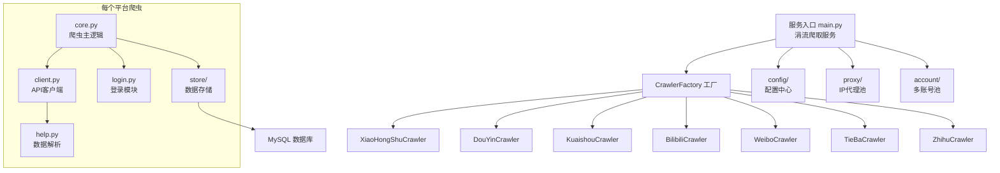
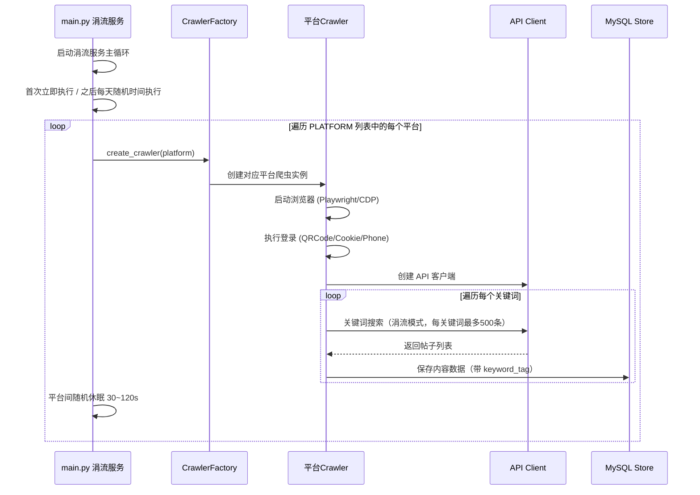

# MediaCrawler 项目技术文档

## 一、项目概述

**MediaCrawler** 是一个多平台社交媒体数据采集服务，基于 Python 异步编程 + Playwright 浏览器自动化技术实现。采用**涓流爬取模式**，以低速、持续的方式每日自动爬取数据，支持从主流社交平台爬取帖子/视频内容、评论、创作者信息等数据，并统一存储至 MySQL 数据库。

### 1.1 支持平台

| 平台缩写 | 平台名称 | 对应类 |
|---------|---------|-------|
| `xhs` | 小红书 | `XiaoHongShuCrawler` |
| `dy` | 抖音 | `DouYinCrawler` |
| `ks` | 快手 | `KuaishouCrawler` |
| `bili` | B站 | `BilibiliCrawler` |
| `wb` | 微博 | `WeiboCrawler` |
| `tieba` | 百度贴吧 | `TieBaCrawler` |
| `zhihu` | 知乎 | `ZhihuCrawler` |

### 1.2 核心功能

- **涓流爬取服务**：每天在配置的时间范围内随机选一个时间执行，模拟人类行为，降低风控风险
- **多平台同时爬取**：`PLATFORM` 配置为列表，支持一次配置多个平台依次爬取
- **关键词搜索**（`search` / `trickle`）：按关键词搜索平台内容
- **帖子详情**（`detail`）：获取指定帖子/视频的详情和评论
- **创作者主页**（`creator`）：获取指定创作者的信息和作品列表
- **关键词标签**：每条数据自动打上 `keyword_tag` / `source_keyword` 字段，标记来源关键词
- **一级评论爬取**：获取帖子/视频下的评论数据
- **IP 代理池**：支持代理 IP 自动轮换
- **CDP 浏览器模式**：使用用户真实浏览器环境，降低检测风险
- **MySQL 数据存储**：所有数据统一存储至 MySQL 数据库

### 1.3 技术栈

| 技术 | 用途 |
|------|------|
| Python 3.11+ | 编程语言 |
| asyncio | 异步并发框架 |
| Playwright | 浏览器自动化（签名计算、登录） |
| httpx | HTTP 异步请求客户端 |
| SQLAlchemy | ORM 数据库映射 |
| aiomysql | MySQL 异步连接池 |
| execjs + Node.js | JS 签名计算（抖音、知乎） |

---

## 二、项目架构

### 2.1 整体架构图



### 2.2 核心流程



---

## 三、目录结构

```
MediaCrawler/
├── main.py                  # 🚀 涓流爬取服务入口
├── var.py                   # 全局上下文变量（ContextVar）
├── pyproject.toml           # 项目依赖配置（uv 管理）
├── requirements.txt         # pip 依赖（兼容）
├── .env.example             # 环境变量模板
│
├── config/                  # ⚙️ 配置中心
│   ├── base_config.py       #   基础配置（平台列表、登录方式、涓流参数等）
│   ├── db_config.py         #   数据库连接配置
│   ├── xhs_config.py        #   小红书平台配置
│   ├── dy_config.py         #   抖音平台配置
│   ├── bilibili_config.py   #   B站平台配置
│   ├── ks_config.py         #   快手平台配置
│   ├── weibo_config.py      #   微博平台配置
│   ├── tieba_config.py      #   贴吧平台配置
│   └── zhihu_config.py      #   知乎平台配置
│
├── base/                    # 🏗️ 抽象基类
│   └── base_crawler.py      #   AbstractCrawler / AbstractLogin / AbstractStore / AbstractApiClient
│
├── media_platform/          # 🕷️ 各平台爬虫实现（核心）
│   ├── xhs/                 #   小红书
│   │   ├── core.py          #     爬虫主逻辑
│   │   ├── client.py        #     API 请求客户端
│   │   ├── login.py         #     登录逻辑
│   │   ├── help.py          #     辅助工具（URL解析等）
│   │   ├── field.py         #     枚举定义
│   │   ├── exception.py     #     异常定义
│   │   ├── xhs_sign.py      #     签名算法
│   │   └── playwright_sign.py #   Playwright 签名
│   ├── douyin/              #   抖音（结构同上）
│   ├── bilibili/            #   B站
│   ├── kuaishou/            #   快手（含 graphql/ 查询文件）
│   ├── weibo/               #   微博
│   ├── tieba/               #   贴吧
│   └── zhihu/               #   知乎
│
├── store/                   # 💾 数据存储层（MySQL Only）
│   ├── __init__.py          #   存储模块入口
│   ├── xhs/                 #   小红书数据存储
│   │   ├── __init__.py      #     存储入口（StoreFactory → MySQL）
│   │   ├── _store_impl.py   #     DbStoreImplement 实现
│   │   └── xhs_store_media.py #   媒体文件存储
│   ├── douyin/              #   抖音数据存储（结构同上）
│   ├── bilibili/            #   B站数据存储
│   ├── kuaishou/            #   快手数据存储
│   ├── weibo/               #   微博数据存储
│   ├── tieba/               #   贴吧数据存储
│   └── zhihu/               #   知乎数据存储
│
├── model/                   # 📦 数据模型（Pydantic / dataclass）
│   ├── m_xiaohongshu.py     #   小红书数据模型
│   ├── m_douyin.py          #   抖音数据模型
│   ├── m_bilibili.py        #   B站数据模型
│   ├── m_kuaishou.py        #   快手数据模型
│   ├── m_weibo.py           #   微博数据模型
│   ├── m_baidu_tieba.py     #   贴吧数据模型
│   └── m_zhihu.py           #   知乎数据模型
│
├── database/                # 🗄️ 数据库 ORM 层
│   ├── db.py                #   数据库初始化入口
│   ├── db_session.py        #   数据库会话管理
│   └── models.py            #   SQLAlchemy ORM 模型定义（20张表）
│
├── account/                 # 👥 多账号管理
│   └── account_pool.py      #   账号池（Cookie轮换、状态追踪、代理绑定）
│
├── proxy/                   # 🌐 IP 代理模块
│   ├── proxy_ip_pool.py     #   代理 IP 池管理
│   ├── proxy_mixin.py       #   代理混入类
│   ├── base_proxy.py        #   代理提供者基类
│   ├── types.py             #   代理相关类型定义
│   └── providers/           #   代理服务商实现
│       ├── kuaidl_proxy.py  #     快代理
│       ├── wandou_http_proxy.py # 豌豆HTTP
│       └── jishu_http_proxy.py  # 极速HTTP
│
├── cache/                   # 🗃️ 缓存模块
│   ├── abs_cache.py         #   缓存抽象基类
│   ├── cache_factory.py     #   缓存工厂
│   ├── local_cache.py       #   本地内存缓存
│   └── redis_cache.py       #   Redis 缓存
│
├── tools/                   # 🔧 工具模块
│   ├── utils.py             #   通用工具函数
│   ├── cdp_browser.py       #   CDP 浏览器管理器
│   ├── browser_launcher.py  #   浏览器启动器
│   ├── crawler_util.py      #   爬虫工具函数
│   ├── slider_util.py       #   滑块验证码工具
│   ├── easing.py            #   缓动函数
│   ├── time_util.py         #   时间工具
│   └── app_runner.py        #   应用运行器（优雅退出）
│
├── libs/                    # 📚 第三方 JS 库
│   ├── stealth.min.js       #   浏览器反检测脚本
│   ├── douyin.js            #   抖音签名 JS
│   └── zhihu.js             #   知乎签名 JS
│
├── constant/                # 📋 常量定义
│   ├── baidu_tieba.py       #   贴吧常量
│   └── zhihu.py             #   知乎常量
│
├── browser_data/            # 🌏 浏览器用户数据缓存
└── docs/                    # 📄 文档目录
```

---

## 四、核心模块详解

### 4.1 程序入口 (`main.py`)

入口文件采用 **涓流服务模式** + **工厂模式**：

```python
class CrawlerFactory:
    CRAWLERS = {
        "xhs": XiaoHongShuCrawler,
        "dy": DouYinCrawler,
        "ks": KuaishouCrawler,
        "bili": BilibiliCrawler,
        "wb": WeiboCrawler,
        "tieba": TieBaCrawler,
        "zhihu": ZhihuCrawler,
    }
```

**主流程**：
1. 启动涓流服务主循环 `trickle_service_loop()`
2. 首次启动立即执行一次 `run_trickle_once()`
3. 之后每天在配置的随机时间范围内执行
4. 每次执行遍历 `PLATFORM` 列表中的所有平台，依次创建爬虫实例并爬取
5. 平台之间随机休眠 30~120 秒，降低风控风险

### 4.2 抽象基类 (`base/base_crawler.py`)

定义了所有爬虫和组件的抽象接口：

| 抽象类 | 职责 |
|-------|------|
| `AbstractCrawler` | 爬虫基类：`start()` / `search()` / `launch_browser()` |
| `AbstractLogin` | 登录基类：`login_by_qrcode()` / `login_by_mobile()` / `login_by_cookies()` |
| `AbstractStore` | 存储基类：`store_content()` / `store_comment()` / `store_creator()` |
| `AbstractApiClient` | API客户端基类：`request()` / `update_cookies()` |

### 4.3 平台爬虫模块 (`media_platform/`)

每个平台目录结构一致：

| 文件 | 职责 |
|------|------|
| `core.py` | 爬虫主逻辑：浏览器启动、登录、搜索/详情/创作者三种模式 |
| `client.py` | API 客户端：封装 HTTP 请求、签名计算、评论翻页 |
| `login.py` | 登录实现：二维码、手机号、Cookie 三种方式 |
| `help.py` | 辅助函数：URL解析、数据格式化、HTML解析 |
| `field.py` | 枚举常量：搜索排序、发布时间筛选等 |
| `exception.py` | 自定义异常 |

#### 各平台签名机制

| 平台 | 签名方式 |
|------|---------| 
| 小红书 | Playwright 浏览器环境调用 JS 签名 |
| 抖音 | `execjs` + `libs/douyin.js` 计算签名 |
| 知乎 | `execjs` + `libs/zhihu.js` 计算签名 |
| 快手 | GraphQL 查询（`graphql/` 目录下 `.graphql` 文件） |
| B站 / 微博 / 贴吧 | 直接 Cookie 鉴权 |

### 4.4 数据存储层 (`store/`)

存储层已精简为 **MySQL Only**，每个平台的 `store/__init__.py` 中通过 `StoreFactory` 直接路由到 `_store_impl.py` 中的 `DbStoreImplement` 类：

```python
STORES = {
    "db": DbStoreImplement,
}
```

数据流：`数据 → StoreFactory → DbStoreImplement → MySQL`

### 4.5 数据库模型 (`database/models.py`)

使用 SQLAlchemy ORM 定义所有平台的数据表，共 **20 张表**：

| 模型类 | 对应表名 | 说明 |
|--------|---------|------|
| `BilibiliVideo` | `bilibili_video` | B站视频 |
| `BilibiliVideoComment` | `bilibili_video_comment` | B站评论 |
| `BilibiliUpInfo` | `bilibili_up_info` | B站UP主信息 |
| `BilibiliContactInfo` | `bilibili_contact_info` | B站UP主与粉丝关系 |
| `BilibiliUpDynamic` | `bilibili_up_dynamic` | B站UP主动态 |
| `DouyinAweme` | `douyin_aweme` | 抖音作品 |
| `DouyinAwemeComment` | `douyin_aweme_comment` | 抖音评论 |
| `DyCreator` | `dy_creator` | 抖音创作者 |
| `KuaishouVideo` | `kuaishou_video` | 快手视频 |
| `KuaishouVideoComment` | `kuaishou_video_comment` | 快手评论 |
| `WeiboNote` | `weibo_note` | 微博帖子 |
| `WeiboNoteComment` | `weibo_note_comment` | 微博评论 |
| `WeiboCreator` | `weibo_creator` | 微博创作者 |
| `XhsNote` | `xhs_note` | 小红书笔记 |
| `XhsNoteComment` | `xhs_note_comment` | 小红书评论 |
| `XhsCreator` | `xhs_creator` | 小红书创作者 |
| `TiebaNote` | `tieba_note` | 贴吧帖子 |
| `TiebaComment` | `tieba_comment` | 贴吧评论 |
| `TiebaCreator` | `tieba_creator` | 贴吧创作者 |
| `ZhihuContent` | `zhihu_content` | 知乎内容 |
| `ZhihuComment` | `zhihu_comment` | 知乎评论 |
| `ZhihuCreator` | `zhihu_creator` | 知乎创作者 |

### 4.6 多账号管理 (`account/account_pool.py`)

支持多个 Cookie 账号轮换爬取，核心特性：
- **轮换策略**：依次使用每个账号的 Cookie 运行爬虫
- **状态追踪**：`active` / `rate_limited` / `expired` / `banned`
- **独立代理**：每个账号可绑定不同的代理 IP
- **自动识别**：根据错误信息自动标记账号状态（过期/限流）

### 4.7 IP 代理模块 (`proxy/`)

支持多个代理服务商：

| 服务商 | 对应配置值 |
|--------|----------|
| 快代理 | `kuaidaili` |
| 豌豆HTTP | `wandouhttp` |
| 极速HTTP | `jishuhttp` |

代理池自动管理 IP 的获取、验证、轮换和过期检测。

### 4.8 CDP 浏览器模式 (`tools/cdp_browser.py`)

通过 Chrome DevTools Protocol 连接用户真实浏览器：
- 自动检测 Chrome/Edge 安装路径
- 使用用户的真实浏览器环境（扩展、Cookie、设置）
- 大幅降低被平台检测为爬虫的风险
- 支持自定义浏览器路径和调试端口

---

## 五、配置说明

### 5.1 基础配置 (`config/base_config.py`)

| 配置项 | 默认值 | 说明 |
|--------|--------|------|
| `PLATFORM` | `["dy"]` | 目标平台列表，支持多个平台同时配置 |
| `KEYWORDS` | `["ai短剧", "ai漫画"]` | 搜索关键词列表 |
| `LOGIN_TYPE` | `"cookie"` | 登录方式：qrcode / phone / cookie |
| `COOKIES` | `""` | Cookie 字符串（cookie 登录时使用） |
| `CRAWLER_TYPE` | `"trickle"` | 爬取模式，服务模式下固定为 trickle |
| `HEADLESS` | `False` | 是否无头浏览器 |
| `ENABLE_CDP_MODE` | `True` | 是否启用 CDP 模式 |
| `CDP_HEADLESS` | `False` | CDP 模式下的无头设置 |
| `CDP_DEBUG_PORT` | `9222` | CDP 调试端口 |
| `SAVE_DATA_OPTION` | `"db"` | 数据保存方式（仅支持 db/MySQL） |
| `CRAWLER_MAX_NOTES_COUNT` | `100` | 最大爬取帖子数（非涓流模式） |
| `MAX_CONCURRENCY_NUM` | `1` | 最大并发数 |
| `ENABLE_GET_COMMENTS` | `False` | 是否爬取评论 |
| `CRAWLER_MAX_COMMENTS_COUNT_SINGLENOTES` | `10` | 单帖子最大评论数 |
| `ENABLE_GET_MEIDAS` | `False` | 是否下载媒体文件 |
| `ENABLE_IP_PROXY` | `False` | 是否启用 IP 代理 |
| `IP_PROXY_PROVIDER_NAME` | `"kuaidaili"` | 代理服务商 |
| `CRAWLER_MAX_SLEEP_SEC` | `2` | 爬取间隔（秒） |
| `START_PAGE` | `1` | 起始爬取页码 |
| `SAVE_LOGIN_STATE` | `True` | 是否保存登录状态 |
| `ENABLE_MULTI_ACCOUNT` | `False` | 是否启用多账号轮换模式 |
| `COOKIES_LIST` | `[]` | 多账号 Cookie 列表 |
| `INIT_DB_ON_STARTUP` | `False` | 启动时是否自动初始化数据库表结构 |

### 5.2 涓流服务配置

| 配置项 | 默认值 | 说明 |
|--------|--------|------|
| `TRICKLE_MAX_NOTES_PER_KEYWORD` | `500` | 每个关键词每日爬取的最大条数 |
| `TRICKLE_SLEEP_BETWEEN_PAGES` | `15` | 每页爬取后的休眠时间（秒） |
| `TRICKLE_SLEEP_BETWEEN_KEYWORDS` | `60` | 关键词之间的休眠时间（秒） |
| `TRICKLE_DAILY_TIME_RANGE_START` | `"01:00"` | 每日执行随机时间范围 - 开始 |
| `TRICKLE_DAILY_TIME_RANGE_END` | `"05:00"` | 每日执行随机时间范围 - 结束 |
| `TRICKLE_ERROR_RETRY_INTERVAL` | `120` | 遇到错误后的重试等待时间（秒） |

### 5.3 数据库配置 (`config/db_config.py`)

通过环境变量或直接修改文件配置：

| 配置项 | 环境变量 | 默认值 |
|--------|---------|--------|
| MySQL 主机 | `MYSQL_DB_HOST` | `localhost` |
| MySQL 端口 | `MYSQL_DB_PORT` | `3306` |
| MySQL 用户名 | `MYSQL_DB_USER` | `root` |
| MySQL 密码 | `MYSQL_DB_PWD` | `123456` |
| MySQL 数据库名 | `MYSQL_DB_NAME` | `media_crawler` |
| Redis 主机 | `REDIS_DB_HOST` | `127.0.0.1` |
| Redis 端口 | `REDIS_DB_PORT` | `6379` |
| Redis 密码 | `REDIS_DB_PWD` | `123456` |

### 5.4 平台特有配置

各平台在 `config/` 下有独立配置文件，包含：
- 搜索排序方式
- 指定帖子/视频 URL 列表（detail 模式）
- 指定创作者 URL 列表（creator 模式）

---

## 六、运行指南

### 6.1 环境准备

```bash
# 1. 安装 uv 包管理器
curl -LsSf https://astral.sh/uv/install.sh | sh

# 2. 安装 Python 依赖
uv sync

# 3. 安装 Playwright 浏览器
uv run playwright install --with-deps chromium

# 4. 安装 Node.js（抖音/知乎签名需要，>=16）
# macOS: brew install node
# Linux: apt install nodejs npm

# 5. 复制环境变量模板（按需修改数据库配置）
cp .env.example .env
```

### 6.2 初始化数据库

首次部署时，需要在 `config/base_config.py` 中设置：

```python
# 启动时自动初始化数据库表结构（首次部署设为 True，建表完成后改回 False）
INIT_DB_ON_STARTUP = True
```

启动服务后会自动创建所有表结构。建表完成后可改回 `False`，避免每次启动都执行建表。

### 6.3 基本使用（涓流服务模式）

直接运行 `main.py` 即可启动涓流爬取服务：

```bash
# 启动涓流爬取服务（使用 config/base_config.py 中的配置）
python main.py
```

服务启动后会：
1. 首次立即执行一轮爬取
2. 之后每天在 `TRICKLE_DAILY_TIME_RANGE_START` ~ `TRICKLE_DAILY_TIME_RANGE_END` 之间随机选时间执行
3. 遍历 `PLATFORM` 列表中的每个平台，依次爬取所有关键词

### 6.4 Linux 无桌面环境部署

```bash
# 必须的配置（在 config/base_config.py 中修改）
HEADLESS = True           # 启用无头模式
LOGIN_TYPE = "cookie"     # 使用 Cookie 登录（无法扫码）
ENABLE_CDP_MODE = False   # 关闭 CDP 模式，使用标准 Playwright

# 安装系统依赖
uv run playwright install --with-deps chromium
```

---

## 七、全局上下文变量 (`var.py`)

使用 `contextvars.ContextVar` 管理异步任务间的共享状态：

| 变量 | 类型 | 用途 |
|------|------|------|
| `request_keyword_var` | `str` | 当前请求的关键词 |
| `crawler_type_var` | `str` | 当前爬取模式 |
| `comment_tasks_var` | `List[Task]` | 评论爬取任务列表 |
| `db_conn_pool_var` | `aiomysql.Pool` | MySQL 数据库连接池 |
| `source_keyword_var` | `str` | 数据来源关键词（用于打 tag） |

---

## 八、MySQL 建表 SQL

以下是所有数据表的完整建表 SQL（MySQL 语法），对应 `database/models.py` 中的 ORM 模型定义。

### 8.1 B站（Bilibili）

#### bilibili_video — B站视频

```sql
CREATE TABLE IF NOT EXISTS `bilibili_video` (
    `id`                   INT           NOT NULL AUTO_INCREMENT COMMENT '主键ID',
    `video_id`             BIGINT        NOT NULL COMMENT '视频ID',
    `video_url`            TEXT          NOT NULL COMMENT '视频URL',
    `user_id`              BIGINT        DEFAULT NULL COMMENT '用户ID',
    `nickname`             TEXT          DEFAULT NULL COMMENT '用户昵称',
    `avatar`               TEXT          DEFAULT NULL COMMENT '用户头像',
    `liked_count`          INT           DEFAULT NULL COMMENT '点赞数',
    `add_ts`               BIGINT        DEFAULT NULL COMMENT '添加时间戳',
    `last_modify_ts`       BIGINT        DEFAULT NULL COMMENT '最后修改时间戳',
    `video_type`           TEXT          DEFAULT NULL COMMENT '视频类型',
    `title`                TEXT          DEFAULT NULL COMMENT '视频标题',
    `desc`                 TEXT          DEFAULT NULL COMMENT '视频描述',
    `create_time`          BIGINT        DEFAULT NULL COMMENT '创建时间戳',
    `disliked_count`       TEXT          DEFAULT NULL COMMENT '点踩数',
    `video_play_count`     TEXT          DEFAULT NULL COMMENT '播放数',
    `video_favorite_count` TEXT          DEFAULT NULL COMMENT '收藏数',
    `video_share_count`    TEXT          DEFAULT NULL COMMENT '分享数',
    `video_coin_count`     TEXT          DEFAULT NULL COMMENT '硬币数',
    `video_danmaku`        TEXT          DEFAULT NULL COMMENT '弹幕数',
    `video_comment`        TEXT          DEFAULT NULL COMMENT '评论数',
    `video_cover_url`      TEXT          DEFAULT NULL COMMENT '视频封面URL',
    `source_keyword`       TEXT          DEFAULT '' COMMENT '来源关键词',
    `keyword_tag`          TEXT          DEFAULT '' COMMENT '关键词标签',
    PRIMARY KEY (`id`),
    UNIQUE KEY `uk_video_id` (`video_id`),
    KEY `idx_user_id` (`user_id`),
    KEY `idx_create_time` (`create_time`)
) ENGINE=InnoDB DEFAULT CHARSET=utf8mb4 COLLATE=utf8mb4_unicode_ci COMMENT='B站视频';
```

#### bilibili_video_comment — B站视频评论

```sql
CREATE TABLE IF NOT EXISTS `bilibili_video_comment` (
    `id`                 INT            NOT NULL AUTO_INCREMENT COMMENT '主键ID',
    `user_id`            VARCHAR(255)   DEFAULT NULL COMMENT '用户ID',
    `nickname`           TEXT           DEFAULT NULL COMMENT '用户昵称',
    `sex`                TEXT           DEFAULT NULL COMMENT '性别',
    `sign`               TEXT           DEFAULT NULL COMMENT '签名',
    `avatar`             TEXT           DEFAULT NULL COMMENT '头像',
    `add_ts`             BIGINT         DEFAULT NULL COMMENT '添加时间戳',
    `last_modify_ts`     BIGINT         DEFAULT NULL COMMENT '最后修改时间戳',
    `comment_id`         BIGINT         DEFAULT NULL COMMENT '评论ID',
    `video_id`           BIGINT         DEFAULT NULL COMMENT '视频ID',
    `content`            TEXT           DEFAULT NULL COMMENT '评论内容',
    `create_time`        BIGINT         DEFAULT NULL COMMENT '创建时间戳',
    `parent_comment_id`  VARCHAR(255)   DEFAULT NULL COMMENT '父评论ID',
    `like_count`         TEXT           DEFAULT '0' COMMENT '点赞数',
    PRIMARY KEY (`id`),
    KEY `idx_comment_id` (`comment_id`),
    KEY `idx_video_id` (`video_id`)
) ENGINE=InnoDB DEFAULT CHARSET=utf8mb4 COLLATE=utf8mb4_unicode_ci COMMENT='B站视频评论';
```

#### bilibili_up_info — B站UP主信息

```sql
CREATE TABLE IF NOT EXISTS `bilibili_up_info` (
    `id`              INT       NOT NULL AUTO_INCREMENT COMMENT '主键ID',
    `user_id`         BIGINT    DEFAULT NULL COMMENT '用户ID',
    `nickname`        TEXT      DEFAULT NULL COMMENT '用户昵称',
    `sex`             TEXT      DEFAULT NULL COMMENT '性别',
    `sign`            TEXT      DEFAULT NULL COMMENT '签名',
    `avatar`          TEXT      DEFAULT NULL COMMENT '头像',
    `add_ts`          BIGINT    DEFAULT NULL COMMENT '添加时间戳',
    `last_modify_ts`  BIGINT    DEFAULT NULL COMMENT '最后修改时间戳',
    `total_fans`      INT       DEFAULT NULL COMMENT '总粉丝数',
    `total_liked`     INT       DEFAULT NULL COMMENT '总获赞数',
    `user_rank`       INT       DEFAULT NULL COMMENT '用户等级',
    `is_official`     INT       DEFAULT NULL COMMENT '是否官方认证',
    PRIMARY KEY (`id`),
    KEY `idx_user_id` (`user_id`)
) ENGINE=InnoDB DEFAULT CHARSET=utf8mb4 COLLATE=utf8mb4_unicode_ci COMMENT='B站UP主信息';
```

#### bilibili_contact_info — B站UP主与粉丝关系

```sql
CREATE TABLE IF NOT EXISTS `bilibili_contact_info` (
    `id`              INT       NOT NULL AUTO_INCREMENT COMMENT '主键ID',
    `up_id`           BIGINT    DEFAULT NULL COMMENT 'UP主ID',
    `fan_id`          BIGINT    DEFAULT NULL COMMENT '粉丝ID',
    `up_name`         TEXT      DEFAULT NULL COMMENT 'UP主名称',
    `fan_name`        TEXT      DEFAULT NULL COMMENT '粉丝名称',
    `up_sign`         TEXT      DEFAULT NULL COMMENT 'UP主签名',
    `fan_sign`        TEXT      DEFAULT NULL COMMENT '粉丝签名',
    `up_avatar`       TEXT      DEFAULT NULL COMMENT 'UP主头像',
    `fan_avatar`      TEXT      DEFAULT NULL COMMENT '粉丝头像',
    `add_ts`          BIGINT    DEFAULT NULL COMMENT '添加时间戳',
    `last_modify_ts`  BIGINT    DEFAULT NULL COMMENT '最后修改时间戳',
    PRIMARY KEY (`id`),
    KEY `idx_up_id` (`up_id`),
    KEY `idx_fan_id` (`fan_id`)
) ENGINE=InnoDB DEFAULT CHARSET=utf8mb4 COLLATE=utf8mb4_unicode_ci COMMENT='B站UP主与粉丝关系';
```

#### bilibili_up_dynamic — B站UP主动态

```sql
CREATE TABLE IF NOT EXISTS `bilibili_up_dynamic` (
    `id`               INT            NOT NULL AUTO_INCREMENT COMMENT '主键ID',
    `dynamic_id`       BIGINT         DEFAULT NULL COMMENT '动态ID',
    `user_id`          VARCHAR(255)   DEFAULT NULL COMMENT '用户ID',
    `user_name`        TEXT           DEFAULT NULL COMMENT '用户名称',
    `text`             TEXT           DEFAULT NULL COMMENT '动态内容',
    `type`             TEXT           DEFAULT NULL COMMENT '动态类型',
    `pub_ts`           BIGINT         DEFAULT NULL COMMENT '发布时间戳',
    `total_comments`   INT            DEFAULT NULL COMMENT '总评论数',
    `total_forwards`   INT            DEFAULT NULL COMMENT '总转发数',
    `total_liked`      INT            DEFAULT NULL COMMENT '总点赞数',
    `add_ts`           BIGINT         DEFAULT NULL COMMENT '添加时间戳',
    `last_modify_ts`   BIGINT         DEFAULT NULL COMMENT '最后修改时间戳',
    PRIMARY KEY (`id`),
    KEY `idx_dynamic_id` (`dynamic_id`)
) ENGINE=InnoDB DEFAULT CHARSET=utf8mb4 COLLATE=utf8mb4_unicode_ci COMMENT='B站UP主动态';
```

### 8.2 抖音（Douyin）

#### douyin_aweme — 抖音作品

```sql
CREATE TABLE IF NOT EXISTS `douyin_aweme` (
    `id`                  INT            NOT NULL AUTO_INCREMENT COMMENT '主键ID',
    `user_id`             VARCHAR(255)   DEFAULT NULL COMMENT '用户ID',
    `sec_uid`             VARCHAR(255)   DEFAULT NULL COMMENT '安全用户ID',
    `short_user_id`       VARCHAR(255)   DEFAULT NULL COMMENT '短用户ID',
    `user_unique_id`      VARCHAR(255)   DEFAULT NULL COMMENT '用户唯一ID',
    `nickname`            TEXT           DEFAULT NULL COMMENT '用户昵称',
    `avatar`              TEXT           DEFAULT NULL COMMENT '用户头像',
    `user_signature`      TEXT           DEFAULT NULL COMMENT '用户签名',
    `ip_location`         TEXT           DEFAULT NULL COMMENT 'IP地址位置',
    `add_ts`              BIGINT         DEFAULT NULL COMMENT '添加时间戳',
    `last_modify_ts`      BIGINT         DEFAULT NULL COMMENT '最后修改时间戳',
    `aweme_id`            BIGINT         DEFAULT NULL COMMENT '作品ID',
    `aweme_type`          TEXT           DEFAULT NULL COMMENT '作品类型',
    `title`               TEXT           DEFAULT NULL COMMENT '作品标题',
    `desc`                TEXT           DEFAULT NULL COMMENT '作品描述',
    `create_time`         BIGINT         DEFAULT NULL COMMENT '创建时间戳',
    `liked_count`         TEXT           DEFAULT NULL COMMENT '点赞数',
    `comment_count`       TEXT           DEFAULT NULL COMMENT '评论数',
    `share_count`         TEXT           DEFAULT NULL COMMENT '分享数',
    `collected_count`     TEXT           DEFAULT NULL COMMENT '收藏数',
    `aweme_url`           TEXT           DEFAULT NULL COMMENT '作品URL',
    `cover_url`           TEXT           DEFAULT NULL COMMENT '封面URL',
    `video_download_url`  TEXT           DEFAULT NULL COMMENT '视频下载URL',
    `music_download_url`  TEXT           DEFAULT NULL COMMENT '音乐下载URL',
    `note_download_url`   TEXT           DEFAULT NULL COMMENT '笔记下载URL',
    `source_keyword`      TEXT           DEFAULT '' COMMENT '来源关键词',
    `keyword_tag`         TEXT           DEFAULT '' COMMENT '关键词标签',
    PRIMARY KEY (`id`),
    KEY `idx_aweme_id` (`aweme_id`),
    KEY `idx_create_time` (`create_time`)
) ENGINE=InnoDB DEFAULT CHARSET=utf8mb4 COLLATE=utf8mb4_unicode_ci COMMENT='抖音作品';
```

#### douyin_aweme_comment — 抖音作品评论

```sql
CREATE TABLE IF NOT EXISTS `douyin_aweme_comment` (
    `id`                 INT            NOT NULL AUTO_INCREMENT COMMENT '主键ID',
    `user_id`            VARCHAR(255)   DEFAULT NULL COMMENT '用户ID',
    `sec_uid`            VARCHAR(255)   DEFAULT NULL COMMENT '安全用户ID',
    `short_user_id`      VARCHAR(255)   DEFAULT NULL COMMENT '短用户ID',
    `user_unique_id`     VARCHAR(255)   DEFAULT NULL COMMENT '用户唯一ID',
    `nickname`           TEXT           DEFAULT NULL COMMENT '用户昵称',
    `avatar`             TEXT           DEFAULT NULL COMMENT '用户头像',
    `user_signature`     TEXT           DEFAULT NULL COMMENT '用户签名',
    `ip_location`        TEXT           DEFAULT NULL COMMENT 'IP地址位置',
    `add_ts`             BIGINT         DEFAULT NULL COMMENT '添加时间戳',
    `last_modify_ts`     BIGINT         DEFAULT NULL COMMENT '最后修改时间戳',
    `comment_id`         BIGINT         DEFAULT NULL COMMENT '评论ID',
    `aweme_id`           BIGINT         DEFAULT NULL COMMENT '作品ID',
    `content`            TEXT           DEFAULT NULL COMMENT '评论内容',
    `create_time`        BIGINT         DEFAULT NULL COMMENT '创建时间戳',
    `parent_comment_id`  VARCHAR(255)   DEFAULT NULL COMMENT '父评论ID',
    `like_count`         TEXT           DEFAULT '0' COMMENT '点赞数',
    `sub_comment_count`  TEXT           DEFAULT '0' COMMENT '子评论数',
    `pictures`           TEXT           DEFAULT '' COMMENT '图片',
    `keyword_tag`        TEXT           DEFAULT '' COMMENT '关键词标签',
    PRIMARY KEY (`id`),
    KEY `idx_comment_id` (`comment_id`),
    KEY `idx_aweme_id` (`aweme_id`)
) ENGINE=InnoDB DEFAULT CHARSET=utf8mb4 COLLATE=utf8mb4_unicode_ci COMMENT='抖音作品评论';
```

#### dy_creator — 抖音创作者

```sql
CREATE TABLE IF NOT EXISTS `dy_creator` (
    `id`              INT            NOT NULL AUTO_INCREMENT COMMENT '主键ID',
    `user_id`         VARCHAR(255)   DEFAULT NULL COMMENT '用户ID',
    `nickname`        TEXT           DEFAULT NULL COMMENT '用户昵称',
    `avatar`          TEXT           DEFAULT NULL COMMENT '用户头像',
    `ip_location`     TEXT           DEFAULT NULL COMMENT 'IP地址位置',
    `add_ts`          BIGINT         DEFAULT NULL COMMENT '添加时间戳',
    `last_modify_ts`  BIGINT         DEFAULT NULL COMMENT '最后修改时间戳',
    `desc`            TEXT           DEFAULT NULL COMMENT '描述',
    `gender`          TEXT           DEFAULT NULL COMMENT '性别',
    `follows`         TEXT           DEFAULT NULL COMMENT '关注数',
    `fans`            TEXT           DEFAULT NULL COMMENT '粉丝数',
    `interaction`     TEXT           DEFAULT NULL COMMENT '互动数',
    `videos_count`    VARCHAR(255)   DEFAULT NULL COMMENT '视频数量',
    PRIMARY KEY (`id`)
) ENGINE=InnoDB DEFAULT CHARSET=utf8mb4 COLLATE=utf8mb4_unicode_ci COMMENT='抖音创作者';
```

### 8.3 快手（Kuaishou）

#### kuaishou_video — 快手视频

```sql
CREATE TABLE IF NOT EXISTS `kuaishou_video` (
    `id`               INT            NOT NULL AUTO_INCREMENT COMMENT '主键ID',
    `user_id`          VARCHAR(64)    DEFAULT NULL COMMENT '用户ID',
    `nickname`         TEXT           DEFAULT NULL COMMENT '用户昵称',
    `avatar`           TEXT           DEFAULT NULL COMMENT '用户头像',
    `add_ts`           BIGINT         DEFAULT NULL COMMENT '添加时间戳',
    `last_modify_ts`   BIGINT         DEFAULT NULL COMMENT '最后修改时间戳',
    `video_id`         VARCHAR(255)   DEFAULT NULL COMMENT '视频ID',
    `video_type`       TEXT           DEFAULT NULL COMMENT '视频类型',
    `title`            TEXT           DEFAULT NULL COMMENT '视频标题',
    `desc`             TEXT           DEFAULT NULL COMMENT '视频描述',
    `create_time`      BIGINT         DEFAULT NULL COMMENT '创建时间戳',
    `liked_count`      TEXT           DEFAULT NULL COMMENT '点赞数',
    `viewd_count`      TEXT           DEFAULT NULL COMMENT '观看数',
    `video_url`        TEXT           DEFAULT NULL COMMENT '视频URL',
    `video_cover_url`  TEXT           DEFAULT NULL COMMENT '视频封面URL',
    `video_play_url`   TEXT           DEFAULT NULL COMMENT '视频播放URL',
    `source_keyword`   TEXT           DEFAULT '' COMMENT '来源关键词',
    `keyword_tag`      TEXT           DEFAULT '' COMMENT '关键词标签',
    PRIMARY KEY (`id`),
    KEY `idx_video_id` (`video_id`),
    KEY `idx_create_time` (`create_time`)
) ENGINE=InnoDB DEFAULT CHARSET=utf8mb4 COLLATE=utf8mb4_unicode_ci COMMENT='快手视频';
```

#### kuaishou_video_comment — 快手视频评论

```sql
CREATE TABLE IF NOT EXISTS `kuaishou_video_comment` (
    `id`              INT            NOT NULL AUTO_INCREMENT COMMENT '主键ID',
    `user_id`         TEXT           DEFAULT NULL COMMENT '用户ID',
    `nickname`        TEXT           DEFAULT NULL COMMENT '用户昵称',
    `avatar`          TEXT           DEFAULT NULL COMMENT '用户头像',
    `add_ts`          BIGINT         DEFAULT NULL COMMENT '添加时间戳',
    `last_modify_ts`  BIGINT         DEFAULT NULL COMMENT '最后修改时间戳',
    `comment_id`      BIGINT         DEFAULT NULL COMMENT '评论ID',
    `video_id`        VARCHAR(255)   DEFAULT NULL COMMENT '视频ID',
    `content`         TEXT           DEFAULT NULL COMMENT '评论内容',
    `create_time`     BIGINT         DEFAULT NULL COMMENT '创建时间戳',
    PRIMARY KEY (`id`),
    KEY `idx_comment_id` (`comment_id`),
    KEY `idx_video_id` (`video_id`)
) ENGINE=InnoDB DEFAULT CHARSET=utf8mb4 COLLATE=utf8mb4_unicode_ci COMMENT='快手视频评论';
```

### 8.4 小红书（XiaoHongShu）

#### xhs_note — 小红书笔记

```sql
CREATE TABLE IF NOT EXISTS `xhs_note` (
    `id`               INT            NOT NULL AUTO_INCREMENT COMMENT '主键ID',
    `user_id`          VARCHAR(255)   DEFAULT NULL COMMENT '用户ID',
    `nickname`         TEXT           DEFAULT NULL COMMENT '用户昵称',
    `avatar`           TEXT           DEFAULT NULL COMMENT '用户头像',
    `ip_location`      TEXT           DEFAULT NULL COMMENT 'IP地址位置',
    `add_ts`           BIGINT         DEFAULT NULL COMMENT '添加时间戳',
    `last_modify_ts`   BIGINT         DEFAULT NULL COMMENT '最后修改时间戳',
    `note_id`          VARCHAR(255)   DEFAULT NULL COMMENT '笔记ID',
    `type`             TEXT           DEFAULT NULL COMMENT '笔记类型',
    `title`            TEXT           DEFAULT NULL COMMENT '笔记标题',
    `desc`             TEXT           DEFAULT NULL COMMENT '笔记描述',
    `video_url`        TEXT           DEFAULT NULL COMMENT '视频URL',
    `time`             BIGINT         DEFAULT NULL COMMENT '时间戳',
    `last_update_time` BIGINT         DEFAULT NULL COMMENT '最后更新时间戳',
    `liked_count`      TEXT           DEFAULT NULL COMMENT '点赞数',
    `collected_count`  TEXT           DEFAULT NULL COMMENT '收藏数',
    `comment_count`    TEXT           DEFAULT NULL COMMENT '评论数',
    `share_count`      TEXT           DEFAULT NULL COMMENT '分享数',
    `image_list`       TEXT           DEFAULT NULL COMMENT '图片列表',
    `tag_list`         TEXT           DEFAULT NULL COMMENT '标签列表',
    `note_url`         TEXT           DEFAULT NULL COMMENT '笔记URL',
    `source_keyword`   TEXT           DEFAULT '' COMMENT '来源关键词',
    `keyword_tag`      TEXT           DEFAULT '' COMMENT '关键词标签',
    `xsec_token`       TEXT           DEFAULT NULL COMMENT 'Xsec Token',
    PRIMARY KEY (`id`),
    KEY `idx_note_id` (`note_id`),
    KEY `idx_time` (`time`)
) ENGINE=InnoDB DEFAULT CHARSET=utf8mb4 COLLATE=utf8mb4_unicode_ci COMMENT='小红书笔记';
```

#### xhs_note_comment — 小红书笔记评论

```sql
CREATE TABLE IF NOT EXISTS `xhs_note_comment` (
    `id`                 INT            NOT NULL AUTO_INCREMENT COMMENT '主键ID',
    `user_id`            VARCHAR(255)   DEFAULT NULL COMMENT '用户ID',
    `nickname`           TEXT           DEFAULT NULL COMMENT '用户昵称',
    `avatar`             TEXT           DEFAULT NULL COMMENT '用户头像',
    `ip_location`        TEXT           DEFAULT NULL COMMENT 'IP地址位置',
    `add_ts`             BIGINT         DEFAULT NULL COMMENT '添加时间戳',
    `last_modify_ts`     BIGINT         DEFAULT NULL COMMENT '最后修改时间戳',
    `comment_id`         VARCHAR(255)   DEFAULT NULL COMMENT '评论ID',
    `create_time`        BIGINT         DEFAULT NULL COMMENT '创建时间戳',
    `note_id`            VARCHAR(255)   DEFAULT NULL COMMENT '笔记ID',
    `content`            TEXT           DEFAULT NULL COMMENT '评论内容',
    `pictures`           TEXT           DEFAULT NULL COMMENT '图片',
    `parent_comment_id`  VARCHAR(255)   DEFAULT NULL COMMENT '父评论ID',
    `like_count`         TEXT           DEFAULT NULL COMMENT '点赞数',
    PRIMARY KEY (`id`),
    KEY `idx_comment_id` (`comment_id`),
    KEY `idx_create_time` (`create_time`)
) ENGINE=InnoDB DEFAULT CHARSET=utf8mb4 COLLATE=utf8mb4_unicode_ci COMMENT='小红书笔记评论';
```

#### xhs_creator — 小红书创作者

```sql
CREATE TABLE IF NOT EXISTS `xhs_creator` (
    `id`              INT            NOT NULL AUTO_INCREMENT COMMENT '主键ID',
    `user_id`         VARCHAR(255)   DEFAULT NULL COMMENT '用户ID',
    `nickname`        TEXT           DEFAULT NULL COMMENT '用户昵称',
    `avatar`          TEXT           DEFAULT NULL COMMENT '用户头像',
    `ip_location`     TEXT           DEFAULT NULL COMMENT 'IP地址位置',
    `add_ts`          BIGINT         DEFAULT NULL COMMENT '添加时间戳',
    `last_modify_ts`  BIGINT         DEFAULT NULL COMMENT '最后修改时间戳',
    `desc`            TEXT           DEFAULT NULL COMMENT '描述',
    `gender`          TEXT           DEFAULT NULL COMMENT '性别',
    `follows`         TEXT           DEFAULT NULL COMMENT '关注数',
    `fans`            TEXT           DEFAULT NULL COMMENT '粉丝数',
    `interaction`     TEXT           DEFAULT NULL COMMENT '互动数',
    `tag_list`        TEXT           DEFAULT NULL COMMENT '标签列表',
    PRIMARY KEY (`id`)
) ENGINE=InnoDB DEFAULT CHARSET=utf8mb4 COLLATE=utf8mb4_unicode_ci COMMENT='小红书创作者';
```

### 8.5 微博（Weibo）

#### weibo_note — 微博帖子

```sql
CREATE TABLE IF NOT EXISTS `weibo_note` (
    `id`                INT            NOT NULL AUTO_INCREMENT COMMENT '主键ID',
    `user_id`           VARCHAR(255)   DEFAULT NULL COMMENT '用户ID',
    `nickname`          TEXT           DEFAULT NULL COMMENT '用户昵称',
    `avatar`            TEXT           DEFAULT NULL COMMENT '用户头像',
    `gender`            TEXT           DEFAULT NULL COMMENT '性别',
    `profile_url`       TEXT           DEFAULT NULL COMMENT '个人主页URL',
    `ip_location`       TEXT           DEFAULT '' COMMENT 'IP地址位置',
    `add_ts`            BIGINT         DEFAULT NULL COMMENT '添加时间戳',
    `last_modify_ts`    BIGINT         DEFAULT NULL COMMENT '最后修改时间戳',
    `note_id`           BIGINT         DEFAULT NULL COMMENT '笔记ID',
    `content`           TEXT           DEFAULT NULL COMMENT '笔记内容',
    `create_time`       BIGINT         DEFAULT NULL COMMENT '创建时间戳',
    `create_date_time`  VARCHAR(255)   DEFAULT NULL COMMENT '创建日期时间',
    `liked_count`       TEXT           DEFAULT NULL COMMENT '点赞数',
    `comments_count`    TEXT           DEFAULT NULL COMMENT '评论数',
    `shared_count`      TEXT           DEFAULT NULL COMMENT '分享数',
    `note_url`          TEXT           DEFAULT NULL COMMENT '笔记URL',
    `source_keyword`    TEXT           DEFAULT '' COMMENT '来源关键词',
    `keyword_tag`       TEXT           DEFAULT '' COMMENT '关键词标签',
    PRIMARY KEY (`id`),
    KEY `idx_note_id` (`note_id`),
    KEY `idx_create_time` (`create_time`),
    KEY `idx_create_date_time` (`create_date_time`)
) ENGINE=InnoDB DEFAULT CHARSET=utf8mb4 COLLATE=utf8mb4_unicode_ci COMMENT='微博帖子';
```

#### weibo_note_comment — 微博帖子评论

```sql
CREATE TABLE IF NOT EXISTS `weibo_note_comment` (
    `id`                 INT            NOT NULL AUTO_INCREMENT COMMENT '主键ID',
    `user_id`            VARCHAR(255)   DEFAULT NULL COMMENT '用户ID',
    `nickname`           TEXT           DEFAULT NULL COMMENT '用户昵称',
    `avatar`             TEXT           DEFAULT NULL COMMENT '用户头像',
    `gender`             TEXT           DEFAULT NULL COMMENT '性别',
    `profile_url`        TEXT           DEFAULT NULL COMMENT '个人主页URL',
    `ip_location`        TEXT           DEFAULT '' COMMENT 'IP地址位置',
    `add_ts`             BIGINT         DEFAULT NULL COMMENT '添加时间戳',
    `last_modify_ts`     BIGINT         DEFAULT NULL COMMENT '最后修改时间戳',
    `comment_id`         BIGINT         DEFAULT NULL COMMENT '评论ID',
    `note_id`            BIGINT         DEFAULT NULL COMMENT '笔记ID',
    `content`            TEXT           DEFAULT NULL COMMENT '评论内容',
    `create_time`        BIGINT         DEFAULT NULL COMMENT '创建时间戳',
    `create_date_time`   VARCHAR(255)   DEFAULT NULL COMMENT '创建日期时间',
    `comment_like_count` TEXT           DEFAULT NULL COMMENT '评论点赞数',
    `parent_comment_id`  VARCHAR(255)   DEFAULT NULL COMMENT '父评论ID',
    PRIMARY KEY (`id`),
    KEY `idx_comment_id` (`comment_id`),
    KEY `idx_note_id` (`note_id`),
    KEY `idx_create_date_time` (`create_date_time`)
) ENGINE=InnoDB DEFAULT CHARSET=utf8mb4 COLLATE=utf8mb4_unicode_ci COMMENT='微博帖子评论';
```

#### weibo_creator — 微博创作者

```sql
CREATE TABLE IF NOT EXISTS `weibo_creator` (
    `id`              INT            NOT NULL AUTO_INCREMENT COMMENT '主键ID',
    `user_id`         VARCHAR(255)   DEFAULT NULL COMMENT '用户ID',
    `nickname`        TEXT           DEFAULT NULL COMMENT '用户昵称',
    `avatar`          TEXT           DEFAULT NULL COMMENT '用户头像',
    `ip_location`     TEXT           DEFAULT NULL COMMENT 'IP地址位置',
    `add_ts`          BIGINT         DEFAULT NULL COMMENT '添加时间戳',
    `last_modify_ts`  BIGINT         DEFAULT NULL COMMENT '最后修改时间戳',
    `desc`            TEXT           DEFAULT NULL COMMENT '描述',
    `gender`          TEXT           DEFAULT NULL COMMENT '性别',
    `follows`         TEXT           DEFAULT NULL COMMENT '关注数',
    `fans`            TEXT           DEFAULT NULL COMMENT '粉丝数',
    `tag_list`        TEXT           DEFAULT NULL COMMENT '标签列表',
    PRIMARY KEY (`id`)
) ENGINE=InnoDB DEFAULT CHARSET=utf8mb4 COLLATE=utf8mb4_unicode_ci COMMENT='微博创作者';
```

### 8.6 百度贴吧（Tieba）

#### tieba_note — 贴吧帖子

```sql
CREATE TABLE IF NOT EXISTS `tieba_note` (
    `id`                INT            NOT NULL AUTO_INCREMENT COMMENT '主键ID',
    `note_id`           VARCHAR(644)   DEFAULT NULL COMMENT '笔记ID',
    `title`             TEXT           DEFAULT NULL COMMENT '笔记标题',
    `desc`              TEXT           DEFAULT NULL COMMENT '笔记描述',
    `note_url`          TEXT           DEFAULT NULL COMMENT '笔记URL',
    `publish_time`      VARCHAR(255)   DEFAULT NULL COMMENT '发布时间',
    `user_link`         TEXT           DEFAULT '' COMMENT '用户链接',
    `user_nickname`     TEXT           DEFAULT '' COMMENT '用户昵称',
    `user_avatar`       TEXT           DEFAULT '' COMMENT '用户头像',
    `tieba_id`          VARCHAR(255)   DEFAULT '' COMMENT '贴吧ID',
    `tieba_name`        TEXT           DEFAULT NULL COMMENT '贴吧名称',
    `tieba_link`        TEXT           DEFAULT NULL COMMENT '贴吧链接',
    `total_replay_num`  INT            DEFAULT 0 COMMENT '总回复数',
    `total_replay_page` INT            DEFAULT 0 COMMENT '总回复页数',
    `ip_location`       TEXT           DEFAULT '' COMMENT 'IP地址位置',
    `add_ts`            BIGINT         DEFAULT NULL COMMENT '添加时间戳',
    `last_modify_ts`    BIGINT         DEFAULT NULL COMMENT '最后修改时间戳',
    `source_keyword`    TEXT           DEFAULT '' COMMENT '来源关键词',
    PRIMARY KEY (`id`),
    KEY `idx_note_id` (`note_id`),
    KEY `idx_publish_time` (`publish_time`)
) ENGINE=InnoDB DEFAULT CHARSET=utf8mb4 COLLATE=utf8mb4_unicode_ci COMMENT='贴吧帖子';
```

#### tieba_comment — 贴吧评论

```sql
CREATE TABLE IF NOT EXISTS `tieba_comment` (
    `id`                 INT            NOT NULL AUTO_INCREMENT COMMENT '主键ID',
    `comment_id`         VARCHAR(255)   DEFAULT NULL COMMENT '评论ID',
    `parent_comment_id`  VARCHAR(255)   DEFAULT '' COMMENT '父评论ID',
    `content`            TEXT           DEFAULT NULL COMMENT '评论内容',
    `user_link`          TEXT           DEFAULT '' COMMENT '用户链接',
    `user_nickname`      TEXT           DEFAULT '' COMMENT '用户昵称',
    `user_avatar`        TEXT           DEFAULT '' COMMENT '用户头像',
    `tieba_id`           VARCHAR(255)   DEFAULT '' COMMENT '贴吧ID',
    `tieba_name`         TEXT           DEFAULT NULL COMMENT '贴吧名称',
    `tieba_link`         TEXT           DEFAULT NULL COMMENT '贴吧链接',
    `publish_time`       VARCHAR(255)   DEFAULT NULL COMMENT '发布时间',
    `ip_location`        TEXT           DEFAULT '' COMMENT 'IP地址位置',
    `note_id`            VARCHAR(255)   DEFAULT NULL COMMENT '笔记ID',
    `note_url`           TEXT           DEFAULT NULL COMMENT '笔记URL',
    `add_ts`             BIGINT         DEFAULT NULL COMMENT '添加时间戳',
    `last_modify_ts`     BIGINT         DEFAULT NULL COMMENT '最后修改时间戳',
    PRIMARY KEY (`id`),
    KEY `idx_comment_id` (`comment_id`),
    KEY `idx_publish_time` (`publish_time`),
    KEY `idx_note_id` (`note_id`)
) ENGINE=InnoDB DEFAULT CHARSET=utf8mb4 COLLATE=utf8mb4_unicode_ci COMMENT='贴吧评论';
```

#### tieba_creator — 贴吧创作者

```sql
CREATE TABLE IF NOT EXISTS `tieba_creator` (
    `id`                     INT           NOT NULL AUTO_INCREMENT COMMENT '主键ID',
    `user_id`                VARCHAR(64)   DEFAULT NULL COMMENT '用户ID',
    `user_name`              TEXT          DEFAULT NULL COMMENT '用户名',
    `nickname`               TEXT          DEFAULT NULL COMMENT '用户昵称',
    `avatar`                 TEXT          DEFAULT NULL COMMENT '用户头像',
    `ip_location`            TEXT          DEFAULT NULL COMMENT 'IP地址位置',
    `add_ts`                 BIGINT        DEFAULT NULL COMMENT '添加时间戳',
    `last_modify_ts`         BIGINT        DEFAULT NULL COMMENT '最后修改时间戳',
    `gender`                 TEXT          DEFAULT NULL COMMENT '性别',
    `follows`                TEXT          DEFAULT NULL COMMENT '关注数',
    `fans`                   TEXT          DEFAULT NULL COMMENT '粉丝数',
    `registration_duration`  TEXT          DEFAULT NULL COMMENT '注册时长',
    PRIMARY KEY (`id`)
) ENGINE=InnoDB DEFAULT CHARSET=utf8mb4 COLLATE=utf8mb4_unicode_ci COMMENT='贴吧创作者';
```

### 8.7 知乎（Zhihu）

#### zhihu_content — 知乎内容

```sql
CREATE TABLE IF NOT EXISTS `zhihu_content` (
    `id`              INT            NOT NULL AUTO_INCREMENT COMMENT '主键ID',
    `content_id`      VARCHAR(64)    DEFAULT NULL COMMENT '内容ID',
    `content_type`    TEXT           DEFAULT NULL COMMENT '内容类型',
    `content_text`    TEXT           DEFAULT NULL COMMENT '内容文本',
    `content_url`     TEXT           DEFAULT NULL COMMENT '内容URL',
    `question_id`     VARCHAR(255)   DEFAULT NULL COMMENT '问题ID',
    `title`           TEXT           DEFAULT NULL COMMENT '标题',
    `desc`            TEXT           DEFAULT NULL COMMENT '描述',
    `created_time`    VARCHAR(32)    DEFAULT NULL COMMENT '创建时间',
    `updated_time`    TEXT           DEFAULT NULL COMMENT '更新时间',
    `voteup_count`    INT            DEFAULT 0 COMMENT '赞同数',
    `comment_count`   INT            DEFAULT 0 COMMENT '评论数',
    `source_keyword`  TEXT           DEFAULT NULL COMMENT '来源关键词',
    `user_id`         VARCHAR(255)   DEFAULT NULL COMMENT '用户ID',
    `user_link`       TEXT           DEFAULT NULL COMMENT '用户链接',
    `user_nickname`   TEXT           DEFAULT NULL COMMENT '用户昵称',
    `user_avatar`     TEXT           DEFAULT NULL COMMENT '用户头像',
    `user_url_token`  TEXT           DEFAULT NULL COMMENT '用户URL Token',
    `add_ts`          BIGINT         DEFAULT NULL COMMENT '添加时间戳',
    `last_modify_ts`  BIGINT         DEFAULT NULL COMMENT '最后修改时间戳',
    PRIMARY KEY (`id`),
    KEY `idx_content_id` (`content_id`),
    KEY `idx_created_time` (`created_time`)
) ENGINE=InnoDB DEFAULT CHARSET=utf8mb4 COLLATE=utf8mb4_unicode_ci COMMENT='知乎内容';
```

#### zhihu_comment — 知乎评论

```sql
CREATE TABLE IF NOT EXISTS `zhihu_comment` (
    `id`                 INT           NOT NULL AUTO_INCREMENT COMMENT '主键ID',
    `comment_id`         VARCHAR(64)   DEFAULT NULL COMMENT '评论ID',
    `parent_comment_id`  VARCHAR(64)   DEFAULT NULL COMMENT '父评论ID',
    `content`            TEXT          DEFAULT NULL COMMENT '评论内容',
    `publish_time`       VARCHAR(32)   DEFAULT NULL COMMENT '发布时间',
    `ip_location`        TEXT          DEFAULT NULL COMMENT 'IP地址位置',
    `like_count`         INT           DEFAULT 0 COMMENT '点赞数',
    `dislike_count`      INT           DEFAULT 0 COMMENT '点踩数',
    `content_id`         VARCHAR(64)   DEFAULT NULL COMMENT '内容ID',
    `content_type`       TEXT          DEFAULT NULL COMMENT '内容类型',
    `user_id`            VARCHAR(64)   DEFAULT NULL COMMENT '用户ID',
    `user_link`          TEXT          DEFAULT NULL COMMENT '用户链接',
    `user_nickname`      TEXT          DEFAULT NULL COMMENT '用户昵称',
    `user_avatar`        TEXT          DEFAULT NULL COMMENT '用户头像',
    `add_ts`             BIGINT        DEFAULT NULL COMMENT '添加时间戳',
    `last_modify_ts`     BIGINT        DEFAULT NULL COMMENT '最后修改时间戳',
    PRIMARY KEY (`id`),
    KEY `idx_comment_id` (`comment_id`),
    KEY `idx_publish_time` (`publish_time`),
    KEY `idx_content_id` (`content_id`)
) ENGINE=InnoDB DEFAULT CHARSET=utf8mb4 COLLATE=utf8mb4_unicode_ci COMMENT='知乎评论';
```

#### zhihu_creator — 知乎创作者

```sql
CREATE TABLE IF NOT EXISTS `zhihu_creator` (
    `id`                INT           NOT NULL AUTO_INCREMENT COMMENT '主键ID',
    `user_id`           VARCHAR(64)   DEFAULT NULL COMMENT '用户ID',
    `user_link`         TEXT          DEFAULT NULL COMMENT '用户链接',
    `user_nickname`     TEXT          DEFAULT NULL COMMENT '用户昵称',
    `user_avatar`       TEXT          DEFAULT NULL COMMENT '用户头像',
    `url_token`         TEXT          DEFAULT NULL COMMENT 'URL Token',
    `gender`            TEXT          DEFAULT NULL COMMENT '性别',
    `ip_location`       TEXT          DEFAULT NULL COMMENT 'IP地址位置',
    `follows`           INT           DEFAULT 0 COMMENT '关注数',
    `fans`              INT           DEFAULT 0 COMMENT '粉丝数',
    `anwser_count`      INT           DEFAULT 0 COMMENT '回答数',
    `video_count`       INT           DEFAULT 0 COMMENT '视频数',
    `question_count`    INT           DEFAULT 0 COMMENT '问题数',
    `article_count`     INT           DEFAULT 0 COMMENT '文章数',
    `column_count`      INT           DEFAULT 0 COMMENT '专栏数',
    `get_voteup_count`  INT           DEFAULT 0 COMMENT '获赞数',
    `add_ts`            BIGINT        DEFAULT NULL COMMENT '添加时间戳',
    `last_modify_ts`    BIGINT        DEFAULT NULL COMMENT '最后修改时间戳',
    PRIMARY KEY (`id`),
    UNIQUE KEY `uk_user_id` (`user_id`),
    KEY `idx_user_id` (`user_id`)
) ENGINE=InnoDB DEFAULT CHARSET=utf8mb4 COLLATE=utf8mb4_unicode_ci COMMENT='知乎创作者';
```

---

## 九、设计模式总结

| 模式 | 应用场景 |
|------|---------| 
| **工厂模式** | `CrawlerFactory` 根据平台名创建爬虫实例 |
| **策略模式** | `store` 层根据配置路由到 MySQL 存储实现 |
| **模板方法** | `AbstractCrawler` 定义爬虫骨架，各平台实现具体逻辑 |
| **观察者/回调** | 评论爬取使用 `callback` 函数实现数据流转 |
| **代理池模式** | `ProxyIpPool` 管理 IP 的获取、验证、轮换 |
| **上下文变量** | `ContextVar` 在异步任务间传递共享状态 |

---

## 十、注意事项

1. **控制爬取频率**：合理设置 `TRICKLE_SLEEP_BETWEEN_PAGES` 和 `TRICKLE_SLEEP_BETWEEN_KEYWORDS`
2. **Cookie 有效期**：Cookie 会过期，需要定期更新
3. **反爬风险**：频繁爬取可能触发平台反爬机制，建议使用代理和多账号轮换
4. **数据库配置**：确保 MySQL 数据库已创建且配置正确，首次运行需初始化表结构
5. **Node.js 依赖**：抖音和知乎的签名计算需要 Node.js 环境（>=16）
